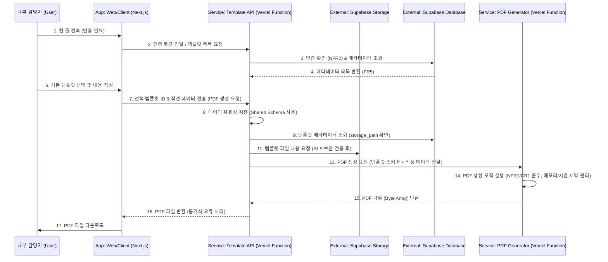

# Core Workflows

```mermaid
sequenceDiagram
    participant U as 내부 담당자 (User)
    participant FE as App: Web/Client (Next.js)
    participant TA as Service: Template API (Vercel Function)
    participant SG as External: Supabase Storage
    participant DB as External: Supabase Database
    participant PF as Service: PDF Generator (Vercel Function)
    
    U->>FE: 1. 웹 툴 접속 (인증 필요)
    FE->>TA: 2. 인증 토큰 전달 / 템플릿 목록 요청
    TA->>DB: 3. 인증 확인 (NFR2) & 메타데이터 조회
    DB-->>TA: 4. 메타데이터 목록 반환 (FR5)
    
    U->>FE: 6. 기본 템플릿 선택 및 내용 작성
    FE->>TA: 7. 선택 템플릿 ID & 작성 데이터 전송 (PDF 생성 요청)
    TA->>TA: 8. 데이터 유효성 검증 (Shared Schema 사용)
    TA->>DB: 9. 템플릿 메타데이터 조회 (storage_path 확인)
    TA->>SG: 11. 템플릿 파일 내용 요청 (RLS 보안 검증 후)
    
    TA->>PF: 13. PDF 생성 요청 (템플릿 스키마 + 작성 데이터 전달)
    PF->>PF: 14. PDF 생성 로직 실행 (NFR1/CR1 준수, 메모리/시간 제약 관리)
    PF-->>TA: 15. PDF 파일 (Byte Array) 반환
    TA-->>FE: 16. PDF 파일 반환 (동기식 오류 처리)
    FE->>U: 17. PDF 파일 다운로드
```

