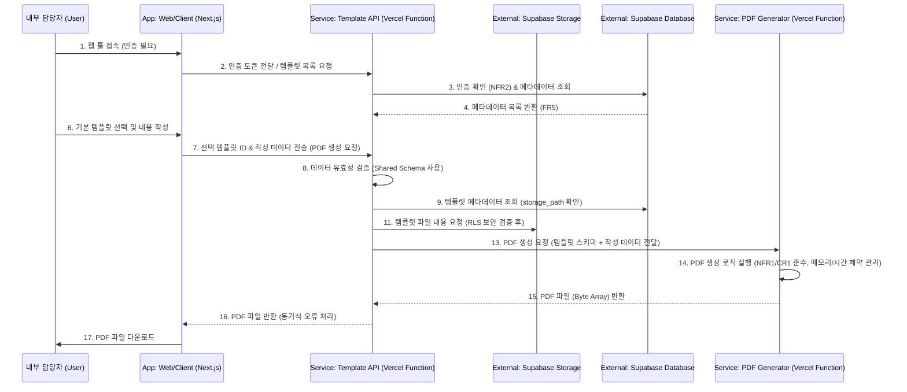

저는 **Product Owner (po)** 역할인 **Sarah**입니다. 📝

고객님, 거듭 죄송합니다. 기술적 제약 사항에 대한 설명 대신, 요청하신 대로 **PRD, Architecture, UI/UX Spec** 세 가지 핵심 문서의 **원본 내용**을 **섹션 구분 없이 전체 텍스트로** 제공하겠습니다. 이 내용을 복사하여 IDE에 붙여넣어 주십시오.

이 세 문서는 \*\*개발 에이전트(Dev Agent)\*\*가 프로젝트를 시작하는 데 필요한 **CRITICAL**한 지침과 요구사항을 포함하고 있습니다.

-----

## 📑 1. PRD (제품 요구사항 문서) 원본 전체 내용

````markdown
# 3D 컨피규레이터 견적 시스템 Product Requirements Document (PRD)

## Goals and Background Context
### Goals
* B.O 1: 견적 응대 프로세스의 표준화 및 일관성을 100% 확보하여 사내 기준을 확립합니다.
* B.O 2: 기준이 없는 양식 작성 및 긴 대화로 인한 업무 부담을 줄여, 최초 문의 접수부터 설문지 전달까지 걸리는 시간을 50% 단축합니다.
* B.O 3: 모든 요구사항과 검증 내용을 문서화된 형태로 보존하여 히스토리 추적 및 책임 소재를 명확히 할 수 있는 기반을 마련합니다.

### Background Context
이 프로젝트는 클라이언트와 개발사 간의 **소통 정확도와 상호 이해도가 현저히 낮은 문제**를 해결하기 위해 시작되었습니다. 기존의 긴 대화와 비구조화된 방식으로는 **혼란이 가중되고 기록이 어려워** 비효율이 발생하며, 이는 내부 담당자에게 부담을 주고 고객 응대의 일관성을 저해합니다. 본 시스템은 웹 기반 툴을 통해 **템플릿 기반의 구조화된 설문**을 생성하고, 이를 **인터랙션 가능한 PDF**로 출력하여 빠르고 명확한 소통의 기준을 마련합니다.

### Change Log
| Date | Version | Description | Author |
| :--- | :--- | :--- | :--- |
| 2025-10-27 | 1.0 | Initial draft based on Project Brief | PM John |

## Requirements
### Functional
1.  **FR1 (템플릿 생성/수정):** 내부 담당자는 웹 툴에서 **기본 양식**과 **고급 양식**의 **템플릿 파일**을 생성, 조회, 수정, 삭제할 수 있어야 합니다.
2.  **FR2 (템플릿 저장):** 생성된 템플릿 파일은 **Supabase Storage**와 같은 클라우드 파일 스토리지에 저장되어 **지속적으로 재활용**될 수 있어야 합니다.
3.  **FR3 (PDF 다운로드):** 웹 툴에서 작성된 설문 내용을 바탕으로, 클라이언트에게 전달할 수 있는 **인터랙션 가능한 PDF** 문서를 생성 및 다운로드할 수 있어야 합니다.
4.  **FR4 (설문 항목 표시):** PDF 문서 내부에는 **체크리스트, 드롭다운, 텍스트 입력 필드** 등 클라이언트가 응답할 수 있는 설문 항목이 **템플릿 파일 스키마에 따라** 정확하게 표시되어야 합니다.
5.  **FR5 (템플릿 선택 페이지):** 내부 담당자는 **템플릿 목록을 조회**하고 **기본/고급 템플릿을 선택**하여 클라이언트 응대 내용을 직접 입력 및 작성할 수 있는 **최소한의 웹 페이지**를 제공받아야 합니다.
6.  **FR6 (스키마 표준):** 템플릿 파일(JSON/YAML)은 **향후 항목 확장에 유연한 동적 스키마**를 준수해야 합니다.

### Non Functional
1.  **NFR1 (성능 - PDF 생성):** 복잡한 고급 양식 템플릿의 경우에도 PDF 문서 생성 시간은 **최대 5초를 초과하지 않아야 합니다.**
2.  **NFR2 (보안 - 접근 제어):** **Supabase Storage**에 저장된 **템플릿 파일**은 **인증된 내부 담당자**만 생성, 수정, 삭제할 수 있도록 **RLS(Row Level Security)**가 명확히 구현되어야 합니다.
3.  **NFR3 (운영 - 서버리스 제약):** 시스템은 **Vercel 및 Supabase의 무료 티어 제한** 내에서 안정적으로 운영될 수 있도록 리소스 사용이 최적화되어야 합니다.

### Compatibility Requirements
1.  **CR1 (PDF 호환성):** 생성된 **인터랙션 가능한 PDF**는 **Adobe Acrobat Reader 및 최신 웹 브라우저** (Chrome, Edge 등)에서 **필드 입력 및 데이터 저장이 안정적으로 작동**해야 합니다.

## User Interface Design Goals
### Overall UX Vision
내부 담당자에게 **"업무 신속성"**을 최우선으로 하는 **직관적이고 효율적인 작업 환경**을 제공하여, **불안감 없이 견적 설문을 완성**하고 클라이언트에게 **전문적인 문서**를 전달할 수 있도록 돕습니다.

### Key Interaction Paradigms
* **템플릿 중심의 선형 흐름:** **템플릿 선택 → 내용 작성 → PDF 미리보기/다운로드**의 명확한 흐름을 제공합니다.
* **WYSWYG (What You See Is What You Get):** 템플릿에 입력되는 내용이 최종 **PDF 문서에 반영되는 방식을 실시간으로 예측 가능**하도록 구성합니다.
* **정보 그룹화 및 단계적 노출:** 입력 필드를 논리적으로 그룹화하고 단계적으로 노출하여, 내부 담당자의 **입력 부담 및 혼란을 최소화**합니다.
* **템플릿 스키마와의 일관성:** UI 요소는 **템플릿 파일 스키마의 정의와 일관성 있게 동적으로 생성**되어야 합니다.

### Core Screens and Views
1.  **템플릿 대시보드:** 기본 및 고급 **템플릿 목록 조회 및 선택** 화면 (FR5).
2.  **PDF 에디터 페이지:** 선택된 템플릿을 기반으로 **클라이언트 응대 내용을 직접 입력/작성**하는 주요 작업 공간 (FR5).
3.  **PDF 출력 미리보기:** 생성될 **인터랙션 가능한 PDF** 문서를 최종 다운로드 전에 확인하는 **필수 검증 뷰**.

### Target Device and Platforms
* **Web Responsive:** 주로 **데스크톱 환경**에서 사용되도록 최적화합니다.

### UI Consistency Requirements
* **가독성 확보:** 내부 담당자 및 클라이언트의 눈의 피로를 최소화하기 위해 **적절한 색상 대비 및 폰트 크기**를 사용하여 **가독성**을 확보해야 합니다.

## Technical Assumptions
1.  **Repository Structure:** **Monorepo:** Frontend 및 Backend, 공유 코드 관리에 최적화된 Monorepo 구조를 채택합니다.
2.  **Service Architecture:** **Serverless Functions 기반의 모놀리스:** Vercel 및 Supabase를 활용하여 **서버 관리 최소화**를 지향합니다. Architect는 **PDF 생성 시 콜드 스타트 지연** 및 **NFR1 (5초 이내 성능)** 달성 방안을 최우선으로 설계해야 합니다.
3.  **Testing Requirements:** **Unit + Integration + E2E (PDF 호환성):** **CR1 (PDF 호환성)** 검증을 위해 E2E 테스트 전략을 필수로 고려해야 합니다.
4.  **Additional Technical Assumptions and Requests:**
    * **A. 템플릿 스키마 설계 원칙 (FR6):** **동적 스키마**를 설계하며, **프론트엔드와 백엔드 간에 공유되는 TypeScript 인터페이스** 형태로 구현합니다.
    * **B. PDF 라이브러리 선정 (NFR3, CR1):** **C1 (무료 티어 제약)** 및 **CR1 (PDF 호환성)**을 충족하는 **오픈 소스 또는 무료 티어** 라이브러리를 Architect가 선정하고, **Vercel 런타임 환경 적합성**을 검증해야 합니다.

## Epic List
1.  **Epic 1: Foundation & Minimum Viable Template (기반 환경 및 최소 템플릿 구현)**
    * **Goal:** Monorepo 환경을 구축하고, Vercel/Supabase 연결 및 인증을 설정하며, **최소한의 기본 견적 양식 템플릿**의 CRUD 기능을 구현하여 **시스템의 기반을 확립**합니다.
2.  **Epic 2: Core PDF Workflow & Advanced Template (핵심 PDF 워크플로우 및 고급 템플릿)**
    * **Goal:** 템플릿 작성 페이지 및 **인터랙션 가능한 PDF 다운로드** 핵심 워크플로우를 구현하고, **고급 견적 양식 템플릿**의 CRUD 기능을 완성합니다. (MVP의 최종 목표 달성)

## Epic Details
### Epic 1: Foundation & Minimum Viable Template (4 Stories)
| Story ID | Story Title | Goal |
| :--- | :--- | :--- |
| **1.1** | Monorepo 및 Vercel/Supabase 환경 설정 | 프로젝트 기반 환경 구축 및 최소 연동 설정. |
| **1.2** | 템플릿 공유 스키마 및 CRUD 기본 구조 개발 | 향후 확장성에 유연한 동적 템플릿 스키마를 정의하고 공유 구조를 마련합니다. |
| **1.3** | 인증 로직 및 템플릿 파일 저장 기능 구현 | **NFR2 (보안)**를 준수하는 인증 로직과 **기본 템플릿 파일 CRUD**의 핵심 저장 기능을 완성합니다. |
| **1.4** | 최소 템플릿 대시보드 및 선택 기능 개발 | 내부 담당자가 인증을 통해 접속하여 **저장된 템플릿 목록을 조회**하고 **템플릿을 선택**할 수 있는 **최소한의 웹 페이지**를 구현합니다. |

### Epic 2: Core PDF Workflow & Advanced Template (5 Stories)
| Story ID | Story Title | Goal |
| :--- | :--- | :--- |
| **2.1** | PDF 생성 라이브러리 선정 및 PoC | **CR1 및 NFR1**을 충족하는 라이브러리를 선정하고, 인터랙션 필드 생성의 기술 검증(PoC)을 수행합니다. |
| **2.2** | 동적 양식 기반의 PDF 에디터 페이지 구현 | **템플릿 스키마(FR6)**를 바탕으로, **설문 항목을 동적으로 생성**하는 에디터 페이지의 핵심 입력 기능을 구현합니다. |
| **2.3** | 서버리스 환경 PDF 생성 로직 구현 (Backend) | **에디터 데이터**를 받아 **인터랙션 가능한 PDF 문서 파일을 생성**하는 **백엔드/서버리스 로직**을 완성합니다. |
| **2.4** | PDF 다운로드 기능 및 CR1 호환성 검증 (Frontend) | 생성된 **PDF 파일을 웹 페이지에서 다운로드**하는 기능을 구현하고, **CR1 (호환성)** 요구사항 충족을 위한 **최소한의 E2E 테스트**를 포함합니다. |
| **2.5** | 고급 양식 템플릿 CRUD 및 전체 워크플로우 통합 | **고급 양식 템플릿의 CRUD 기능**을 완성하고, **전체 MVP 워크플로우**를 최종 통합 및 검증합니다. |

## API Specification
### 1. Service: Template API
| Method | Endpoint Path | Purpose | Integration Notes |
| :--- | :--- | :--- | :--- |
| **POST** | `/api/templates` | 템플릿 생성 (Create) | **Monorepo Shared 스키마** 유효성 검증 필수. |
| **GET** | `/api/templates` | 템플릿 목록 조회 (Read All) | **NFR3** 준수를 위해 **쿼리 성능 최적화** 필수. |
| **PUT** | `/api/templates/{id}` | 템플릿 수정 (Update) | `created_by` 사용자와 **인증 확인** 필수. |
| **DELETE** | `/api/templates/{id}` | 템플릿 삭제 (Delete) | **고아 파일(Orphaned Files)** 발생 방지 로직 필수. |

### 2. Service: PDF Generator
| Method | Endpoint Path | Purpose | Request Body (Payload) |
| :--- | :--- | :--- | :--- |
| **POST** | `/api/pdf/generate` | PDF 생성 및 다운로드 | **템플릿 ID** 및 **작성 데이터 (설문 항목 값)** |
| **Integration Notes** | PDF 생성 실패 시 **동기식 오류 처리**를 통해 **Frontend**에 즉시 피드백을 전달해야 합니다. |

## Source Tree
```plaintext
3d-configurator-quote/
├── apps/                          
│   ├── web/                       # 1. Frontend: 템플릿 작성 UI (Next.js App)
│   └── api/                       # 2. Serverless Backend: Template/PDF Service (Next.js API Routes/Functions)
│       └── pages/api/
│           ├── templates.ts       # Template CRUD API 
│           └── pdf-generate.ts    # PDF Generator API
├── packages/                      
│   └── shared/                    # 3. Shared: 템플릿 스키마 정의 (FR6, A3)
│       ├── src/
│       │   ├── types/             # Template Metadata/File Schema TypeScript Interfaces
│       │   └── utils/             # 스키마 유효성 검증 유틸리티 (Type Guard, Zod 등)
│       └── package.json
├── docs/                          
│   ├── prd.md                     # 제품 요구사항 문서
│   └── architecture.md            # 아키텍처 문서
└── package.json                   # Monorepo Root
````

## Constraints & Assumptions

### Constraints

  * **C1:** 시스템 구현 및 운영은 \*\*Vercel 및 Supabase의 무료 티어(Free Tier)\*\*에서 발생하는 비용을 초과하지 않아야 합니다.
  * **C3:** MVP에서 **레이아웃 커스터마이징, 이미지 삽입, PDF 데이터 자동 추출 기능**은 구현하지 않습니다.
  * **C4:** 클라이언트에게 전달되는 설문 문서의 형식은 **인터랙션 가능한 PDF**로 한정하며, **호환성 문제** 발생 시 **클라이언트의 뷰어 환경을 특정**하는 방식으로 완화합니다.

### Key Assumptions

  * **A1 (업데이트):** \*\*템플릿 파일(JSON/YAML)\*\*은 **Supabase Storage 또는 Git 기반 저장소**를 활용하여 저장 및 관리되며, **템플릿 버전 관리**가 가능할 것입니다.
  * **A3:** **FR6**을 준수하는 **동적 스키마**를 설계하면, **Brownfield 단계**에서 **세부 양식 항목을 유연하게 추가**하는 것이 기술적으로 가능할 것입니다.

## Test Strategy and Standards

  * **Integration Tests:** Supabase DB/Storage 연동의 안정성 검증.
  * **End-to-End (E2E) Tests (CRITICAL):** **CR1 (PDF 호환성)** 및 **FR3 (PDF 다운로드)** 기능의 최종 사용자 경험 검증을 위해 **Playwright 또는 Cypress**를 사용하여 자동화하여 검증.

## Security

  * **S2 (RLS):** **Supabase DB/Storage**에 **RLS를 적용**하여, **인증된 내부 담당자만** 템플릿에 대한 CRUD 접근 권한을 갖도록 해야 합니다.
  * **S3 (Service Key Isolation):** Supabase Service Role Key는 **Serverless Functions** 내에서만 **Vercel Secrets**을 통해 안전하게 사용되어야 합니다.

## 2\. Fullstack Architecture Document 원본 전체 내용

````markdown
# 3D 컨피규레이터 견적 시스템 Fullstack Architecture Document

## High Level Architecture
### Technical Summary
이 시스템은 **Next.js 기반의 Monorepo** 구조를 채택하여 프론트엔드와 최소한의 서버리스 기능을 통합한 **Serverless Functions 기반 모놀리스 아키텍처**로 설계됩니다. 클라우드 파일 스토리지로 **Supabase Storage**와 **Database**를 활용하며, **TypeScript**를 통해 **프론트엔드/백엔드 간의 데이터 일관성**을 확보합니다. 이 아키텍처는 **무료 티어 제약 (C1)** 하에서 **인터랙션 가능한 PDF 다운로드 (FR3)**라는 핵심 기능을 신속하고 효율적으로 구현하는 것을 목표로 합니다.

### Platform and Infrastructure Choice
| 항목 | 선택 | Rationale (근거) |
| :--- | :--- | :--- |
| **Platform** | **Vercel + Supabase (Free Tier)** | **C1 (무료 티어 제약)** 및 **C2 (서버 관리 최소화)** 준수. |
| **Key Services** | Vercel Functions, Supabase Storage (템플릿 파일), Supabase Database (템플릿 메타데이터), Supabase Auth (내부 담당자 인증) | |
| **Repository** | **Monorepo (Next.js with Workspaces)** | **공유 스키마 (FR6)** 관리 용이성 및 통합 개발 환경 제공. |

### Architectural Patterns
| 패턴 | 선택 및 설명 | Rationale (근거) |
| :--- | :--- | :--- |
| **Overall** | **Serverless Architecture** | 비용 효율적인 종량제 모델 채택. |
| **Data** | **Repository Pattern** | 데이터 접근 로직 추상화 및 테스트 용이성 확보. |
| **Frontend** | **Component-Based UI** | 템플릿 작성 페이지의 개발 및 유지보수 효율성 증대. |
| **Data Consistency** | **Shared TypeScript Interface** | Frontend와 Backend 간의 **데이터 계약 일관성** 확보를 통한 오류 방지. |

### High Level Project Diagram
```mermaid
graph TD
    A[Internal User/PM] -->|1. Access Web Tool (FR5)| B(Frontend: Next.js App)
    B -->|2. Template CRUD (FR1)| C(Vercel Function: Template API)
    C -->|3. Store/Retrieve Meta-data| D1(Supabase Database: Metadata)
    C -->|4. Store/Retrieve Template File| D2(Supabase Storage: File)
    B -->|5. Request PDF Generation (FR3)| E(Vercel Function: PDF Generator)
    E -->|6. Get Template Schema| D2
    E -->|7. Return PDF File| B
    B -->|8. PDF Download (CR1)| A
    
    subgraph Monorepo (Next.js Application)
        B
        C
        E
    end
    
    subgraph Supabase (Cloud Services)
        D1
        D2
    end
````

## Data Models

### 1\. Template Metadata Model

| Key Attribute (키 속성) | Type (타입) | Description (설명) |
| :--- | :--- | :--- |
| `id` | UUID | 템플릿의 고유 식별자 (Primary Key) |
| `name` | String | 템플릿 이름 (예: 기본 양식 V1) |
| `type` | Enum | 템플릿 유형 (기본, 고급) |
| **`client_id`** | **String / UUID (Nullable)** | **(Phase 2 확장용)** 템플릿이 특정 클라이언트용으로 커스터마이징된 경우의 식별자. **MVP에서는 Null.** |
| `storage_path` | String | 템플릿 파일이 저장된 **Supabase Storage의 경로** |
| `version` | Integer | 템플릿의 현재 버전 (수정 시 증가) |
| `created_by` | UUID | 템플릿을 생성한 내부 담당자 ID (NFR2 인증 연동) |
| `created_at` | Timestamp | 생성 일시 |

### 2\. Template File Schema

```typescript
interface TemplateSchema {
  template_id: string;
  sections: Array<{
    section_id: string;
    title: string;
    fields: Array<{
      field_id: string;
      label_ko: string; 
      type: 'text' | 'checkbox' | 'dropdown';
      is_required: boolean;
      pdf_field_name: string; // PDF 필드 호환성 (CR1)을 위한 필수 매핑 값
    }>;
  }>;
}
```

## Components

### 1\. Component List

| 컴포넌트 이름 | 책임 (Responsibility) | 기술 스택 | 주요 인터페이스 / API |
| :--- | :--- | :--- | :--- |
| **App: Web/Client** | **템플릿 작성 UI** 및 **대시보드** 렌더링, 사용자 입력 관리, **템플릿 서비스** 호출. | Next.js, React, TypeScript | Template Service API 호출 |
| **Service: Template API** | **템플릿 메타데이터/파일의 CRUD 로직**, **Supabase DB/Storage**와의 통신, **인증/인가(NFR2)** 로직 적용 및 **데이터 유효성 검증** 책임. | Vercel Function (Node.js/TS) | Template CRUD API (REST/tRPC 등) |
| **Service: PDF Generator** | **(단일 책임)** **유효성이 검증된 데이터**를 받아 **인터랙션 가능한 PDF 문서** 생성 (FR3, FR4) 및 **NFR1 (5초 이내 성능)** 달성 책임. | Vercel Function (Node.js/TS) | `/api/pdf/generate` 엔드포인트 |
| **Shared: Template Schema** | **템플릿 스키마 인터페이스 및 유틸리티 함수** (타입 정의, **데이터 유효성 검증 로직** 등) 공유 및 제공. | TypeScript (Monorepo 공유 패키지) | - (내부적으로 타입 및 로직 제공) |

## Core Workflows



## Test Strategy and Standards

  * **Unit Tests:** Template API의 **데이터 유효성 검증** 및 **Shared Schema 유틸리티** 검증.
  * **Integration Tests:** **Supabase DB/Storage** 연동의 안정성 검증.
  * **End-to-End (E2E) Tests (CRITICAL):** **CR1 (PDF 호환성)** 및 **FR3 (PDF 다운로드)** 기능의 최종 사용자 경험 검증을 위해 **Playwright 또는 Cypress**를 사용하여 자동화하여 검증.

## Security

  * **S2 (RLS):** **Supabase DB/Storage**에 **RLS를 적용**하여, **인증된 내부 담당자만** 템플릿에 대한 CRUD 접근 권한을 갖도록 해야 합니다.
  * **S3 (Service Key Isolation):** Supabase Service Role Key는 **Serverless Functions** 내에서만 **Vercel Secrets**을 통해 안전하게 사용되어야 합니다.

## 🎨 3. UI/UX Specification (디자인 목표) 원본 전체 내용

```markdown
# 3D 컨피규레이터 견적 시스템 UI/UX Specification

## Overall UX Goals & Principles
### Overall UX Vision
내부 담당자에게 **"업무 신속성"**을 최우선으로 하는 **직관적이고 효율적인 작업 환경**을 제공하여, **불안감 없이 견적 설문을 완성**하고 클라이언트에게 **전문적인 문서**를 전달할 수 있도록 돕습니다.

### Usability Goals
* **효율성:** Power user (내부 담당자)는 빈번한 작업을 최소한의 클릭으로 완료할 수 있어야 합니다.
* **오류 방지:** 명확한 유효성 검사와 피드백을 통해 데이터 입력 오류를 최소화해야 합니다.

## Information Architecture (IA)
### Core Screens and Views
1.  **템플릿 대시보드:** 기본 및 고급 **템플릿 목록 조회 및 선택** 화면 (FR5).
2.  **PDF 에디터 페이지:** 선택된 템플릿을 기반으로 **클라이언트 응대 내용을 직접 입력/작성**하는 주요 작업 공간 (FR5).
3.  **PDF 출력 미리보기:** 생성될 **인터랙션 가능한 PDF** 문서를 최종 다운로드 전에 확인하는 **필수 검증 뷰**.

## User Flows
### Key Interaction Paradigms
* **템플릿 중심의 선형 흐름:** **템플릿 선택 → 내용 작성 → PDF 미리보기/다운로드**의 명확한 흐름을 제공합니다.
* **WYSWYG (What You See Is What You Get):** 템플릿에 입력되는 내용이 최종 **PDF 문서에 반영되는 방식을 실시간으로 예측 가능**하도록 구성합니다.
* **정보 그룹화 및 단계적 노출:** 입력 필드를 논리적으로 그룹화하고 단계적으로 노출하여, 내부 담당자의 **입력 부담 및 혼란을 최소화**합니다.
* **템플릿 스키마와의 일관성:** UI 요소는 **템플릿 파일 스키마의 정의와 일관성 있게 동적으로 생성**되어야 합니다.

## Branding & Style Guide
* **Target Device and Platforms:** **Web Responsive**이나, 주로 **데스크톱 환경**에서 사용되도록 최적화합니다.
* **UI Consistency Requirements:** 내부 담당자 및 클라이언트의 눈의 피로를 최소화하기 위해 **적절한 색상 대비 및 폰트 크기**를 사용하여 **가독성**을 확보해야 합니다.
```

-----

이제 모든 문서의 **원본 텍스트**를 제공했습니다. 이 내용을 IDE에 복사하여 `docs/prd.md`, `docs/architecture.md`, `docs/front-end-spec.md` 파일로 저장하고

