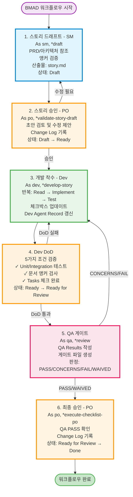
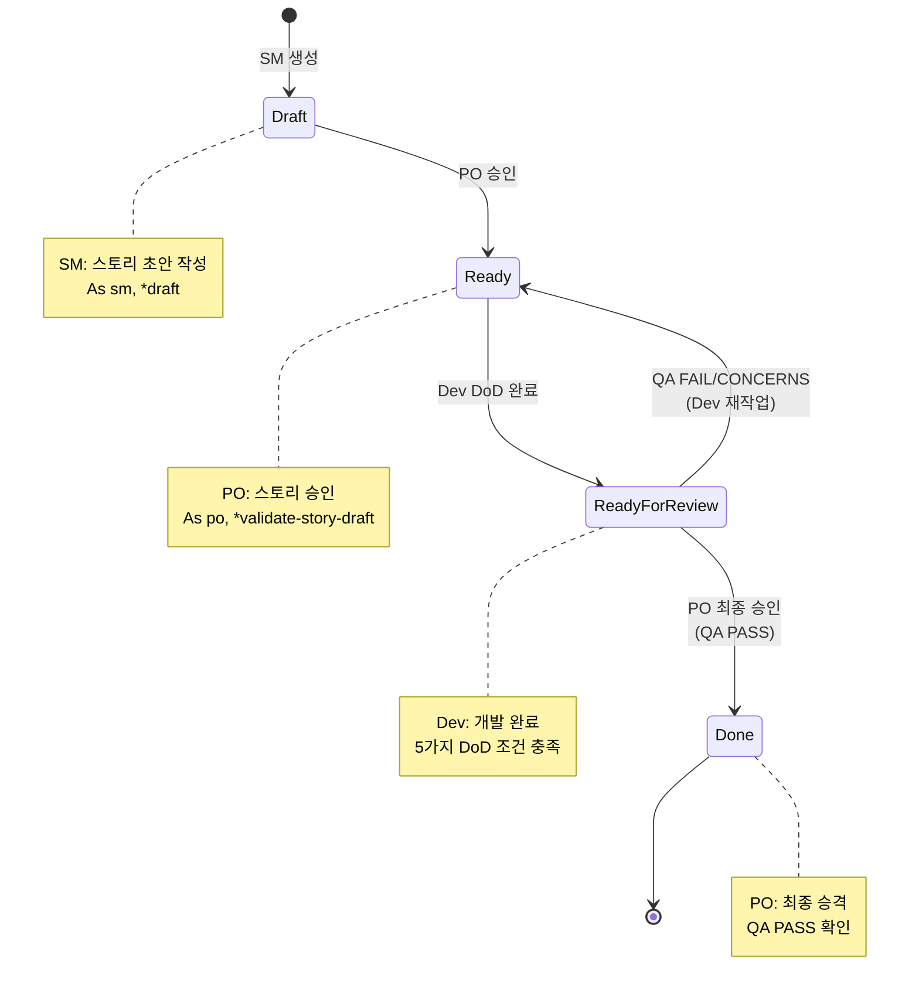
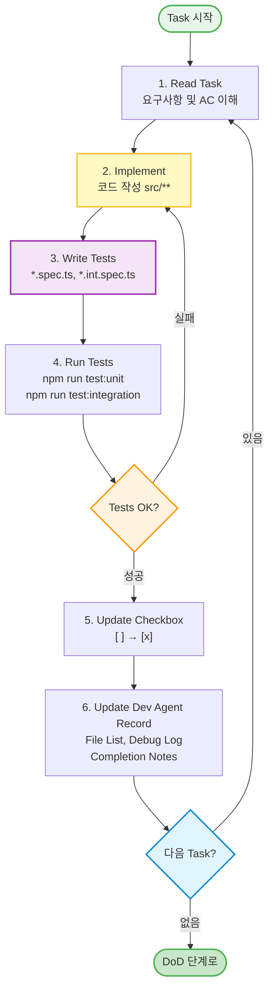
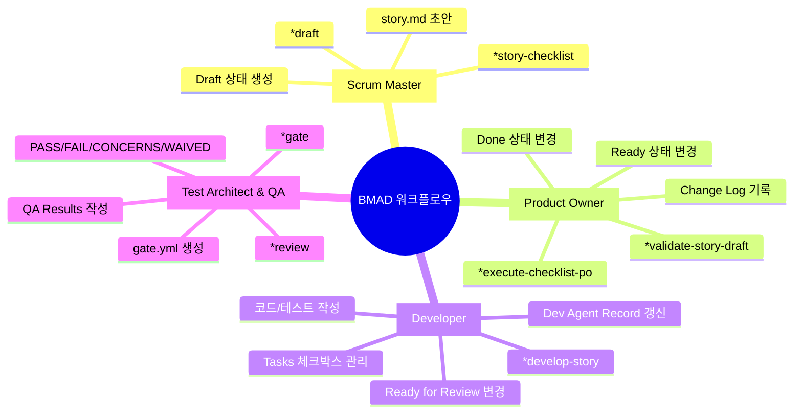
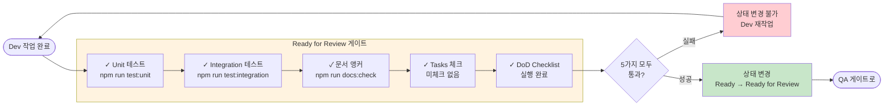
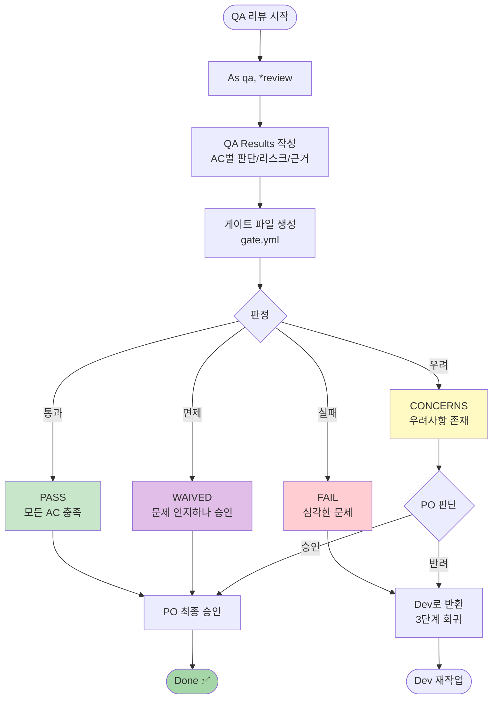
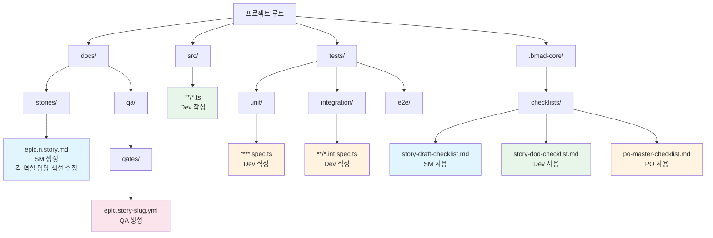

# BMAD 워크플로우 시각화

본 문서는 BMAD METHOD의 전체 워크플로우를 시각적으로 표현합니다.

> **시각화 도구**: 이 문서는 Mermaid 다이어그램을 사용합니다. VSCode에서 프리뷰 모드로 보거나 GitHub에서 자동 렌더링됩니다.
>
> **인터랙티브 버전**: 클릭/확장 가능한 마인드맵은 [워크플로우-인터랙티브.html](./워크플로우-인터랙티브.html)을 브라우저에서 열어보세요.

## 📊 전체 프로세스 흐름도 (Mermaid)



## 🎯 상태 전이 다이어그램 (Mermaid)



## 🔄 개발 반복 사이클 (Mermaid)



## 👥 역할별 책임 (Mermaid)



## 🚪 Ready for Review 게이트 (Mermaid)



## 🎭 QA 게이트 판정 흐름 (Mermaid)



## 📁 산출물 구조 (Mermaid)



---

## 🚪 품질 게이트 체크포인트

### Ready for Review 진입 조건 (Dev DoD)

```
┌─────────────────────────────────────────────────────────┐
│  Ready for Review 게이트 - 필수 5가지 충족               │
├─────────────────────────────────────────────────────────┤
│  ✓ 1. Unit 테스트 통과                                   │
│      → npm run test:unit                                │
│                                                          │
│  ✓ 2. Integration 테스트 통과                            │
│      → npm run test:integration                         │
│                                                          │
│  ✓ 3. 문서 앵커 검사 통과                                │
│      → npm run docs:check                               │
│                                                          │
│  ✓ 4. 모든 Tasks/Subtasks 체크완료                      │
│      → Select-String -Pattern "- \[ \]" (결과 비어야 함) │
│                                                          │
│  ✓ 5. Dev DoD Checklist 실행 완료                       │
│      → .bmad-core/checklists/story-dod-checklist.md     │
└─────────────────────────────────────────────────────────┘
```

### QA 게이트 판정 기준

```
┌──────────────┬────────────────────────────────────────────┐
│   판정 결과   │              의미 및 다음 단계               │
├──────────────┼────────────────────────────────────────────┤
│    PASS      │ 모든 AC 충족 → PO 최종 승인 단계로 진행     │
├──────────────┼────────────────────────────────────────────┤
│   CONCERNS   │ 우려사항 존재 → PO 판단 필요                │
│              │ (Dev 반환 또는 조건부 승인)                 │
├──────────────┼────────────────────────────────────────────┤
│    FAIL      │ 심각한 문제 → Dev로 반환 (필수)             │
├──────────────┼────────────────────────────────────────────┤
│   WAIVED     │ 문제 인지하나 승인됨 → PO 승인 필요         │
└──────────────┴────────────────────────────────────────────┘
```


## 🎓 실행 예시 (Story 1.7)

```
1️⃣  SM 단계
    $ As sm, *draft
    $ As sm, *story-checklist
    $ npm run docs:check
    → 산출물: docs/stories/1.7.story.md (Status: Draft)

2️⃣  PO 승인
    $ As po, *validate-story-draft 1.7
    → 상태 변경: Draft → Ready

3️⃣  Dev 구현
    $ As dev, *develop-story 1.7
    → Task 1 구현 → 테스트 작성 → [x] 체크
    → Task 2 구현 → 테스트 작성 → [x] 체크
    → ...
    $ npm run test:unit
    $ npm run test:integration

4️⃣  Dev DoD
    $ npm run test:unit && npm run test:integration && npm run docs:check
    $ Select-String -Pattern "- \[ \]" docs/stories/1.7.story.md
    → DoD Checklist 실행
    → 상태 변경: Ready → Ready for Review

5️⃣  QA 리뷰
    $ As qa, *review 1.7
    → QA Results 섹션 작성
    → 게이트 파일 생성: docs/qa/gates/1.7-yaml-parser-templateschema-validation.yml
    → 판정: PASS

6️⃣  PO 최종 승인
    $ As po, *execute-checklist-po
    → QA PASS 확인
    → Change Log 기록
    → 상태 변경: Ready for Review → Done ✅
```

## ⚠️ 주요 주의사항

### 🚫 금지 사항

- `AGENTS.md`의 자동 생성 영역(`<!-- BEGIN: BMAD-AGENTS --> … <!-- END -->`) 직접 수정 금지
- 역할 권한 범위를 벗어난 섹션 수정 금지
- Ready for Review 게이트 5가지 조건 미충족 시 상태 변경 금지

### ✅ 필수 사항

- 매 Task/Subtask 완료 시 즉시 체크박스 업데이트
- Dev Agent Record 수시 갱신
- 외부 의존성 추가 시 사전 승인 및 라이선스/보안 검토

### 🔍 검증 명령 모음

```bash
# 전체 테스트 및 문서 검사
npm run test:unit && npm run test:integration && npm run docs:check

# 미체크 항목 찾기 (PowerShell)
Select-String -Path "docs/stories/{story}.story.md" -Pattern "- \[ \]"

# 미체크 항목 찾기 (ripgrep)
rg -n "- \[ \]" docs/stories/{story}.story.md
```

---

**참고**: 본 시각화는 [워크플로우.md](워크플로우.md)를 기반으로 작성되었습니다.
